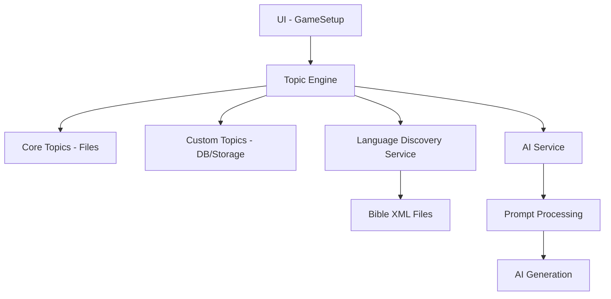

# 📖 Bible Trivia Scriptorium

A professional, AI-powered Bible trivia engine built with React, Vite, and advanced prompt engineering. The Scriptorium is designed to be **Universal**, **Modular**, and **Highly Scalable**.

## ✨ Key Features

### 🧠 Advanced AI Question Engine
- **Broad Knowledge**: Generates high-quality trivia from across the entire Bible using LLMs.
- **Contextual Anchoring**: When a specific Bible reference is provided, the AI focuses its questions on that passage while leveraging its broad knowledge for deep explanations.
- **Smart Fallbacks**: Each topic includes isolated fallback questions to ensure the game remains playable even when offline.

### 🌍 Universal Language Discovery
- **XML-Agnostic**: Drop any Bible XML file (Luo, Spanish, Swahili, etc.) into the `/public/bible/` folder.
- **Auto-Detection**: The engine automatically identifies the language of new Bible versions and adjusts the entire UI and AI generation to match.
- **Local Language Profiles**: Modular language data allows for precise tuning of UI translations for any dialect.

### 📂 Modular Topic Engine
- **Isolated Debugging**: Each trivia topic (e.g., Love, Faith, Miracles) is stored in its own isolated `.js` file.
- **Developer-Friendly**: Test and debug specific topic instructions or fallback banks without touching the rest of the application.
- **User-Defined Topics**: Users can add their own custom topics directly from the frontend, which are persisted via LocalStorage.

### 🎨 Premium Glassmorphism UI
- **Modern Aesthetics**: A stunning dark-mode interface featuring sophisticated backdrop blurs, gold gradients, and fluid micro-animations.
- **Responsive Design**: Seamlessly shifts from desktop browsers to mobile devices.

---

## 🛠️ Architecture



---

## 🚀 Getting Started

### Prerequisites
- Node.js (v20.x or higher)
- npm or yarn

### Installation
1. Clone the repository
2. Install dependencies:
   ```bash
   npm install
   ```
3. Start the development server:
   ```bash
   npm run dev
   ```

### Backend connection
The frontend uses `VITE_API_BASE`, defaulting to the hosted PythonAnywhere API.
For a local backend running on port 5555, open the local frontend with `?env=local`.
Use `?env=prod` to clear that saved override and reconnect to the hosted API.
Restart Vite after changing environment files. Hosted builds ignore local-only backend URLs.

### Adding New Bible Versions
1. Place your Bible XML file in `public/bible/`.
2. The app will automatically discover the file and attempt to detect its language upon selection.

---

## 📖 Developer Guide

### Creating a New Topic
To add a core topic to the engine, create a new file in `src/data/topics/`:

```javascript
// src/data/topics/hope.js
export default {
  id: "hope",
  names: {
    en: "Hope",
    sw: "Tumaini",
    luo: "Geno"
  },
  promptGuidance: "Focus on biblical hope (tikvah/elpis) as a confident expectation.",
  fallbackQuestions: [
    { 
      question: "Which bird brought back an olive leaf to Noah?", 
      options: ["Raven", "Dove", "Eagle", "Sparrow"], 
      correct: "Dove" 
    }
  ]
};
```

### Deployment
This project is configured for one-click deployment on **Vercel**.
```bash
vercel --prod
```

---

## 📜 License
This project is for personal and educational use. May it be a tool for sharpening your knowledge of the Word.
